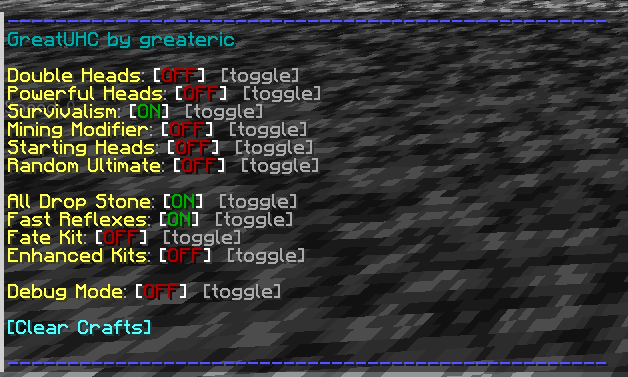

# Configuring Guide

## Config file (`config.yml`)

Most of the settings of the plugin can be changed in this file,
including settings like the world border sizes, the amounts of time between each phase, or how far away players are spread out.

The explanations for each setting are in the file itself.

## In-game options (`/uhc`)

Game modifiers and settings can be edited using the `/uhc` command so they're easier to change between games.

Using `/uhc` will open a menu that looks like this:

Game modifiers:

- `/uhc double-heads` - toggles whether player drop double the heads
- `/uhc powerful-heads` - toggles whether player heads also give resistance
- `/uhc survivalism` (enabled by default) - toggles whether players take less damage from non-PvP sources
- `/uhc mining-modifier` - if enabled, ores drop extra
- `/uhc starting-heads` - if enabled, everyone gets 3 heads at the start of the game
- `/uhc random-ultimate` - if enabled, everyone gets a random ultimate item at the start of the game (everyone gets the same one)

Game settings:

- `/uhc all-drop-stone` - toggles whether all stone variants (andesite, etc.) drop cobblestone
- `/uhc fast-reflexes` - toggles between 1.8-style spam click PvP and modern version attack cooldowns
- `/uhc fate-kit` - toggles whether players can use the fate kit (this also sets the max number of dice crafts to unlimited)
- `/uhc enhanced-kits` - toggles whether the kits are enhanced (see the kits guide for more details)

Other commands:

- `/uhc debug-mode` - toggles debug mode (you probably don't need this)
- `/uhc crafts` - clears the counters for the custom crafts, doesn't change any other settings
- `/uhc extend-clock <number of seconds, positive or negative>` - extends (or shortens) the clock by the specified number of seconds
