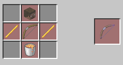
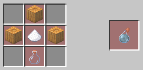
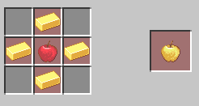

# Kits and Crafts

## Kits

### Armorer

- Leather Helmet (protection 1, unbreaking 1)
- Leather Chestplate (protection 1, unbreaking 1)
- Leather Leggings (protection 1, unbreaking 1)
- Leather Boots (protection 1, unbreaking 1)

Enhancement: a random piece is upgraded to iron armor

### Stone Gear

- Stone Sword (unbreaking 1)
- Stone Pickaxe (efficiency 2, unbreaking 1)
- Stone Axe (efficiency 2, unbreaking 1)
- Stone Shovel (efficiency 2, unbreaking 1)

Enhancement: a random tool is upgraded to iron

### Ecologist

- Lily Pad x64
- Oak Log x20
- Apple x3
- Sugar Cane x3
- Stone Pickaxe (efficiency 1)

Enhancement: carrots, cow eggs, chicken eggs, or coal blocks

### Enchanter

- Leather x6
- Sugar Cane x12
- XP Bottle x30
- Stone Pickaxe (efficiency 1)

Enhancement: obsidian, books, or a random enchanted book

### Archer

- String x3
- Feather x7
- Stone Shovel (efficiency 1)

Enhancement: flint, bones, or arrows

### Fire Lord

- Wooden Sword (fire aspect)
- Lava Bucket x5
- Flint and Steel x1

Enhancement: blaze rod x2

### Monster Trainer

- Zombie Spawn Egg x2
- Skeleton Spawn Egg x2
- Creeper Spawn Egg x2
- Spider Spawn Egg x2

Enhancement: ender pearl, magma cream, or slime ball

### Fate Kit

*This is an overpowered easter egg kit that can only be used if it's enabled with `/uhc fate-kit`.*

- Mossy Cobblestone x63
- Jukebox x9
- Player Head x11
- Gold Ingot x32
- Apple x3
- Oak Planks x64
- Iron Ingot x32
- Anvil x1
- Super XP Bottle x32
- Paper x12
- Flint x2
- Bow
- Arrow x48

Enhancement: receive higher quantities of the items listed above

### Enhancing kits

You can enable/disable the enhanced versions of the kits using `/uhc enhanced-kits`

## Basic Crafts

### Weapons and Armor

Apprentice Helmet: A stronger iron helmet with protection 1, blast protection 1, projectile protection 1, and fire protection 1. (1 craft)

Tarnhelm: A stronger diamond helmet with protection 2, blast protection 1, projectile protection 1, and fire protection 1. (1 craft)

Undead Bow: Deals extra damage to all enemies.

Cupid's Bow: A bow with flame.

Apprentice Sword: An iron sword that gains increasing levels of sharpness over time. (1 craft)

Apprentice Bow: A bow that gains increasing levels of power over time. (1 craft)

### Tools

Quick Pick: A better iron pickaxe with efficiency 1.

Philosopher's Pickaxe: A pickaxe with fortune 2 but only 3 durability left. Can't be repaired. (1 craft)

### Enchantments

Book of Sharpnening: A craftable sharpness 1 book. (4 crafts)

Nether Blessing: A book with protection 2, thorns 1, and unbreaking 2 created from the Nether. (1 craft)

Book of Protection: A craftable protection 1 book. (4 crafts)

Book of Power: A craftable power 1 book. (4 crafts)

### Potions & Healing

Holy Water: Heals 8 hearts. (3 crafts)

Golden Head: Very strong healing and can eat instantly. (2 crafts)

Velocity Potion: A potion that can briefly give your speed a massive boost. (3 crafts)

Nectar: Gives 4 absorption hearts. (3 crafts)

Sugar Cookie: This cookie will energize you and give you speed and jump boost. (3 crafts)

Potion of Toughness: Gives you resistance. (1 craft)

### Others

Light Apple: A cheaper golden apple. (2 crafts)

Light Anvil: A cheaper anvil.

Flaming Artifact: A blaze rod. (1 craft)

Arrow Economy: Gives you 20 arrows for the price of 12. (3 crafts)

Apple Economy: Lets you get extra apples. (3 crafts)

Backpack: A shulker box to increase the size of your inventory. (1 craft)

Delicious Meal: Instantly cooks your meat. (3 crafts)

Glass Economy: Instantly turns sand into glass. (3 crafts)

Sugar Economy: Gives you extra sugar cane. (3 crafts)

Obsidian: Lets you craft obsidian from lava and water. (1 craft)

## Ultimate Crafts

WIP

## Special Crafts

WIP (dice, fates temptation, chest of fate)